# Схема базы данных

Обзор схемы основной БД joinrpg.ru. Источник истины — классы в `src/JoinRpg.DataModel`
и fluent-конфигурация в [`src/JoinRpg.Dal.Impl/MyDbContext.cs`](../src/JoinRpg.Dal.Impl/MyDbContext.cs).
Основная БД — **MS SQL Server, Entity Framework 6** (не EF Core). Миграции —
`src/JoinRpg.Dal.Impl/Migrations`, см. [ef-migrations.md](ef-migrations.md).

Помимо основной БД есть две отдельные PostgreSQL-БД на EF Core — очередь уведомлений
и трекинг ночных джоб, они описаны [в конце](#отдельные-бд-postgresql).

> **Документ поддерживается вручную.** Как его перегенерировать после изменения модели —
> см. [db-schema-regenerate.md](db-schema-regenerate.md).

## Как читать

Схема большая (≈40 таблиц), поэтому она разложена на **обзорную карту** и **диаграммы по доменам**
с полным составом полей. Соглашения:

* Имена таблиц — фактические имена в БД (`dbo.*`), имена полей — фактические колонки.
* `PK` / `FK` / `UK` — первичный ключ / внешний ключ / уникальный индекс.
* Комплексные типы EF6 (`MarkdownDbValue`, `IntList`) раскладываются в колонки
  `{Property}_Contents` и `{Property}_ListIds` — так они и показаны.
* Почти все FK на `Projects`/`Users` — с `NO ACTION` (каскад выключен явно, см. `ConfigureCascadeDeleteOff`).
  На диаграммах каскадность не отражена, чтобы не удваивать число линий.
* Показаны все колонки, которые реально есть в базе, — включая осиротевшие: колонка осталась
  от старой миграции, а модель её уже не отображает. Такие помечены `legacy` в комментарии.
* Сверка документа с реальной схемой автоматическая — тест `DbSchemaDocumentationScenario`
  в `JoinRpg.IntegrationTest` поднимает базу миграциями и сравнивает её с этим файлом.

---

## Обзорная карта

Только «хабовые» таблицы и связи между доменами. Поля опущены.

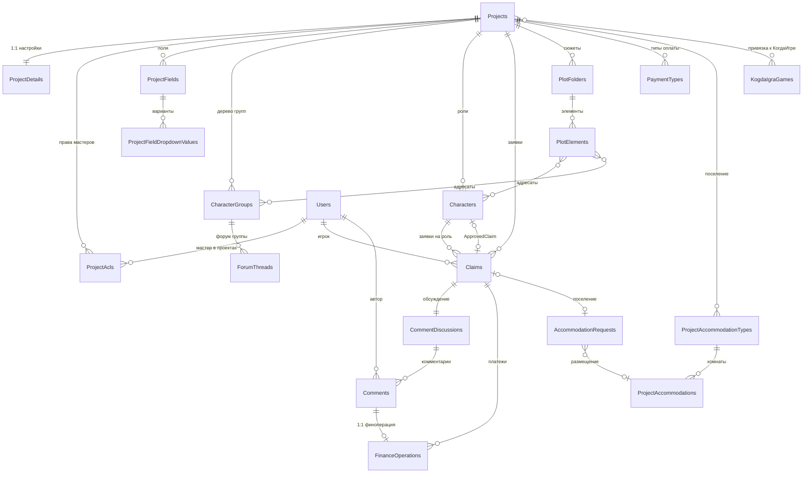

Ключевая особенность модели: **значения полей персонажей и заявок не нормализованы** —
они лежат JSON-ом в `Characters.JsonData` / `Claims.JsonData`, а `ProjectFields` описывает
только метаданные полей. Точно так же денормализовано дерево групп: родители хранятся
строкой id через запятую в `ParentGroupsImpl_ListIds` (с 2016 года, миграция `NewParentGroups`),
а не таблицей связи.

---

## 1. Проект и его настройки

```mermaid
erDiagram
    Projects {
        int ProjectId PK
        string ProjectName
        datetime CreatedDate
        bool Active
        bool IsAcceptingClaims
        datetime CharacterTreeModifiedAt "obsolete, заменяется версией метаданных"
    }

    ProjectDetails {
        int ProjectId PK "он же FK на Projects, 1:1"
        string ClaimApplyRules_Contents "markdown"
        string ProjectAnnounce_Contents "markdown"
        bool IsPublicProject
        bool EnableManyCharacters
        bool AllowSecondRoles
        bool AutoAcceptClaims
        bool PublishPlot
        bool ScheduleEnabled
        bool EnableCheckInModule
        bool CheckInProgress
        bool EnableAccommodation
        bool FinanceWarnOnOverPayment
        bool PreferentialFeeEnabled
        string PreferentialFeeConditions_Contents "markdown"
        int CharacterNameField_ProjectFieldId FK "null = имя игрока"
        int CharacterDescription_ProjectFieldId FK "null = нет описания"
        int DefaultTemplateCharacterId FK "шаблон новой роли"
        int DefaultProjectRolesListId FK "сетка ролей по умолчанию"
        int ClonedFromProjectId FK "откуда клонирован"
        enum ProjectCloneSettings
        bool DisableKogdaIgraMapping
        string FieldsOrdering "порядок полей, строка id"
        string PlotFoldersOrdering
        enum RequireRealName "MandatoryStatus"
        enum RequireTelegram
        enum RequireVkontakte
        enum RequirePhone
        enum RequirePassport
        enum RequireRegistrationAddress
    }

    ProjectAcls {
        int ProjectAclId PK
        int ProjectId FK
        int UserId FK
        guid Token "токен-приглашение мастера"
        bool IsOwner
        bool CanGrantRights
        bool CanChangeFields
        bool CanChangeProjectProperties
        bool CanManageClaims
        bool CanEditRoles
        bool CanManageMoney
        bool CanSendMassMails
        bool CanManagePlots
        bool CanManageAccommodation
        bool CanSetPlayersAccommodations
    }

    CaptainAccessRuleEntities {
        int CaptainAccessRuleEntityId PK
        int ProjectId FK
        int CharacterGroupId FK "группа, которой командует капитан"
        int CaptainUserId FK
        bool CanApprove
    }

    ProjectRolesLists {
        int ProjectRolesListId PK
        int ProjectId FK
        string Name
        int CharacterGroupId FK "корень сетки, null = весь проект"
        bool PublicMode
        string FieldsImpl_ListIds "показываемые поля, строка id"
        enum ContactsColumn "ProjectRolesListVisibilityMode"
        enum GroupsColumn
        enum GroupsViewMode "RolesGridGroupsViewMode"
        enum ShowRolesFilter
    }

    GameReport2DTemplate {
        int GameReport2DTemplateId PK
        string GameReport2DTemplateName
        int ProjectId FK
        int FirstCharacterGroupId FK "ось X"
        int SecondCharacterGroupId FK "ось Y"
        datetime CreatedAt
        int CreatedById FK
        datetime UpdatedAt
        int UpdatedById FK
    }

    KogdaIgraGames {
        int KogdaIgraGameId PK "ид на стороне КогдаИгры, не автоинкремент"
        string Name
        bool Active
        string RegionName
        datetime Begin
        datetime End
        string MasterGroupName
        string SiteUri
        string VkClub
        string LjComm
        string TelegramChannel
        string JsonGameData "сырой ответ КогдаИгры"
        datetimeoffset UpdateRequestedAt "UpdateRequestedAt больше LastUpdatedAt = пора обновить"
        datetimeoffset LastUpdatedAt
    }

    KogdaIgraGameProjects {
        int KogdaIgraGame_KogdaIgraGameId PK "FK"
        int Project_ProjectId PK "FK"
    }

    AdvertisementLogEntries {
        int AdvertisementLogEntryId PK
        int ScheduleId "расписание захардкожено, FK нет (ADR010)"
        int Method "канал"
        int ProjectId FK
        int CharacterId FK "null = реклама игры, не роли"
        int Status
        datetimeoffset SentAt
    }

    Projects ||--|| ProjectDetails : ""
    Projects ||--o{ ProjectAcls : ""
    Projects ||--o{ CaptainAccessRuleEntities : ""
    Projects ||--o{ ProjectRolesLists : ""
    Projects ||--o{ GameReport2DTemplate : ""
    Projects ||--o{ AdvertisementLogEntries : ""
    Projects ||--o{ KogdaIgraGameProjects : ""
    KogdaIgraGames ||--o{ KogdaIgraGameProjects : ""
    ProjectDetails }o--o| Projects : "ClonedFromProject"
```

`ProjectAcls.Token` — токен-приглашение мастера, генерируется при создании записи.
`CaptainAccessRuleEntities` — отдельный от ACL механизм: капитан группы, который может
согласовывать заявки в свою группу. Таблица `AdvertisementLogEntries` отображается
с класса `AdvertisementLogEntryEntity` (имя таблицы задано явно в `MyDbContext`).

---

## 2. Метаданные полей

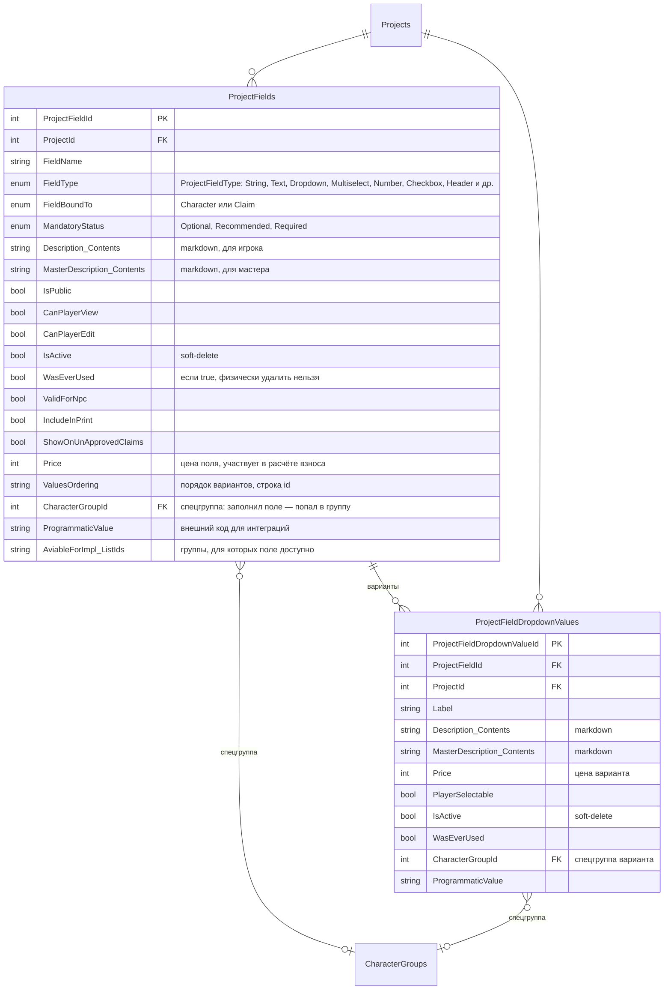

Самих **значений** полей в схеме нет: они в `Characters.JsonData` и `Claims.JsonData`
(словарь `ProjectFieldId → значение`). Поэтому изменение метаданных поля не требует
миграции данных, но и запросить «все персонажи со значением X» SQL-ом напрямую нельзя.

---

## 3. Персонажи, группы, заявки

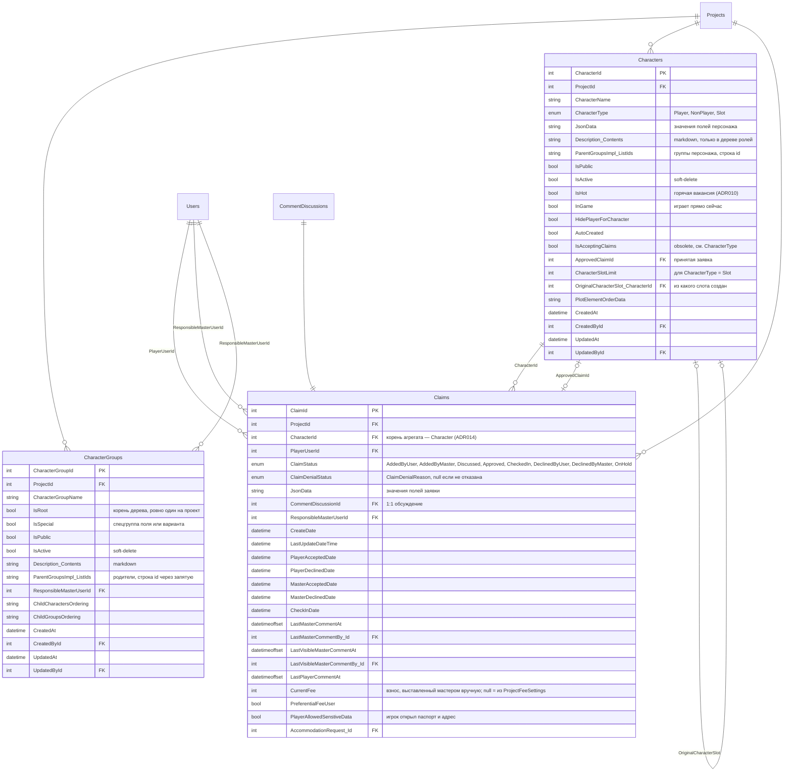

Дерево групп и принадлежность персонажей группам — **не FK**, а строки id
(`ParentGroupsImpl_ListIds`). Ссылочной целостности на уровне БД тут нет,
за консистентностью следит домен; актуальное дерево читается через
`IProjectMetadataRepository` (кешируется на запрос).

---

## 4. Сюжеты

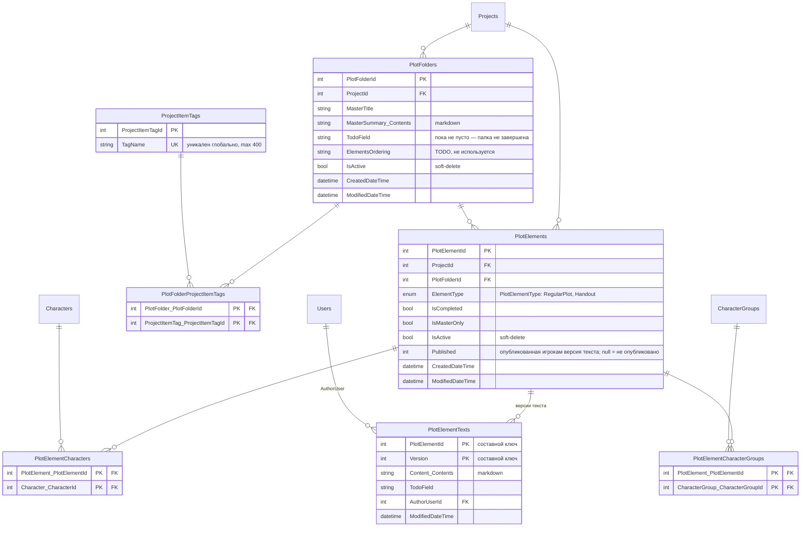

Текст элемента сюжета вынесен в отдельную таблицу с версионированием
(`PlotElementTexts`, ключ `PlotElementId + Version`) — чтобы грузить пачку элементов
без текстов. `PlotElements.Published` указывает на опубликованную версию.

---

## 5. Комментарии и форум

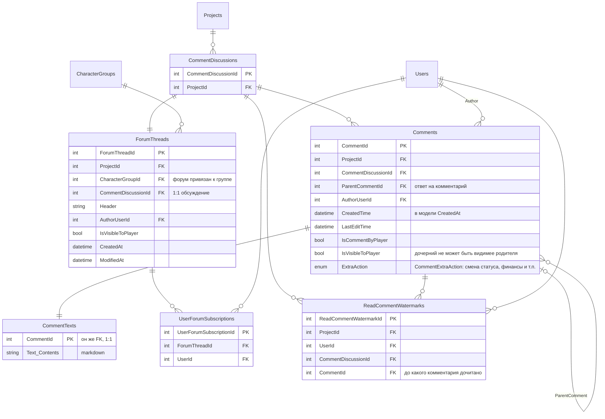

`CommentDiscussions` — общая сущность обсуждения: ровно одно у каждой заявки
и ровно одно у каждой ветки форума. Текст комментария вынесен в `CommentTexts`
по той же причине, что и текст сюжета: комментарии часто грузят пачкой
(анализ финансов, поиск проблем), а текст нужен только на странице заявки.
Подписки на форум (`UserForumSubscriptions`) в коде пока никогда не создаются.

---

## 6. Финансы

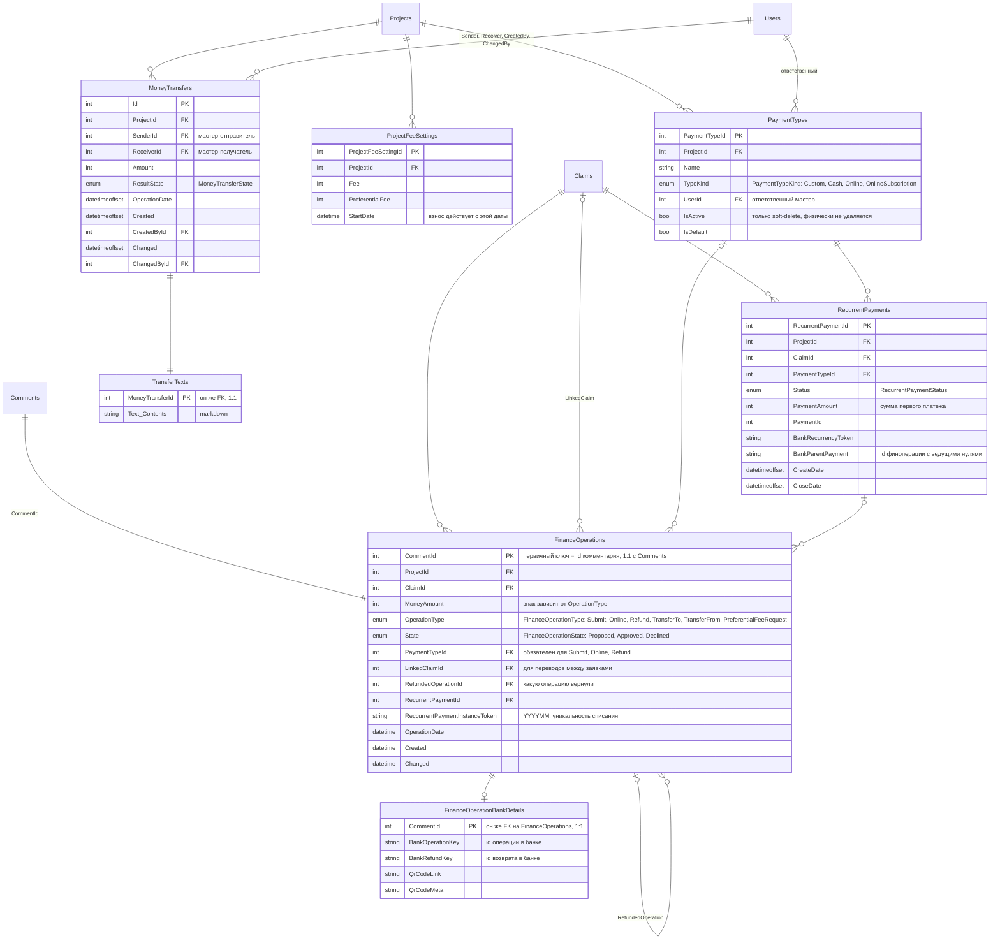

Главная неочевидность: **у `FinanceOperations` первичный ключ — `CommentId`**.
Каждая финансовая операция физически является комментарием к заявке, отдельного
автоинкрементного Id у неё нет. `FinanceOperationBankDetails` продолжает ту же
1:1-цепочку по тому же ключу.

Взнос игрока считается так: `Claims.CurrentFee`, если он задан вручную; иначе
подходящая по дате запись `ProjectFeeSettings`; плюс сумма цен заполненных полей
(`ProjectFields.Price`, `ProjectFieldDropdownValues.Price`).

---

## 7. Поселение

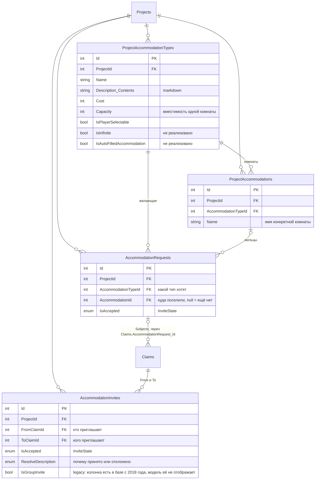

Заявка на поселение — **групповая**: одна `AccommodationRequest` объединяет несколько
`Claims` (связь идёт от заявки: `Claims.AccommodationRequest_Id`). `AccommodationInvites` —
приглашения «поселись со мной», между заявками.

---

## 8. Пользователи

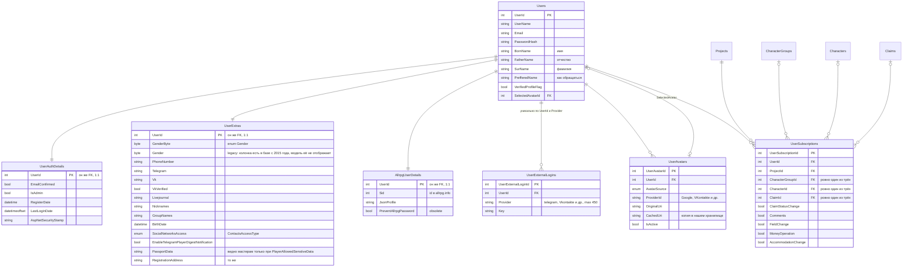

`UserSubscriptions` — подписка на события; ровно одна из трёх ссылок
(`CharacterGroupId`, `CharacterId`, `ClaimId`) должна быть заполнена, это проверяется
в `IValidatableObject`, а не в БД.

Два виртуальных пользователя зарезервированы по email: `payments@joinrpg.ru`
(онлайн-платежи) и `robot@joinrpg.ru` (фоновые джобы).

---

## Отдельные БД (PostgreSQL)

Это **не** часть основной БД: отдельные подключения, EF Core, свои миграции.
FK на `Users`/`Projects` тут нет физически — только id и индексы.

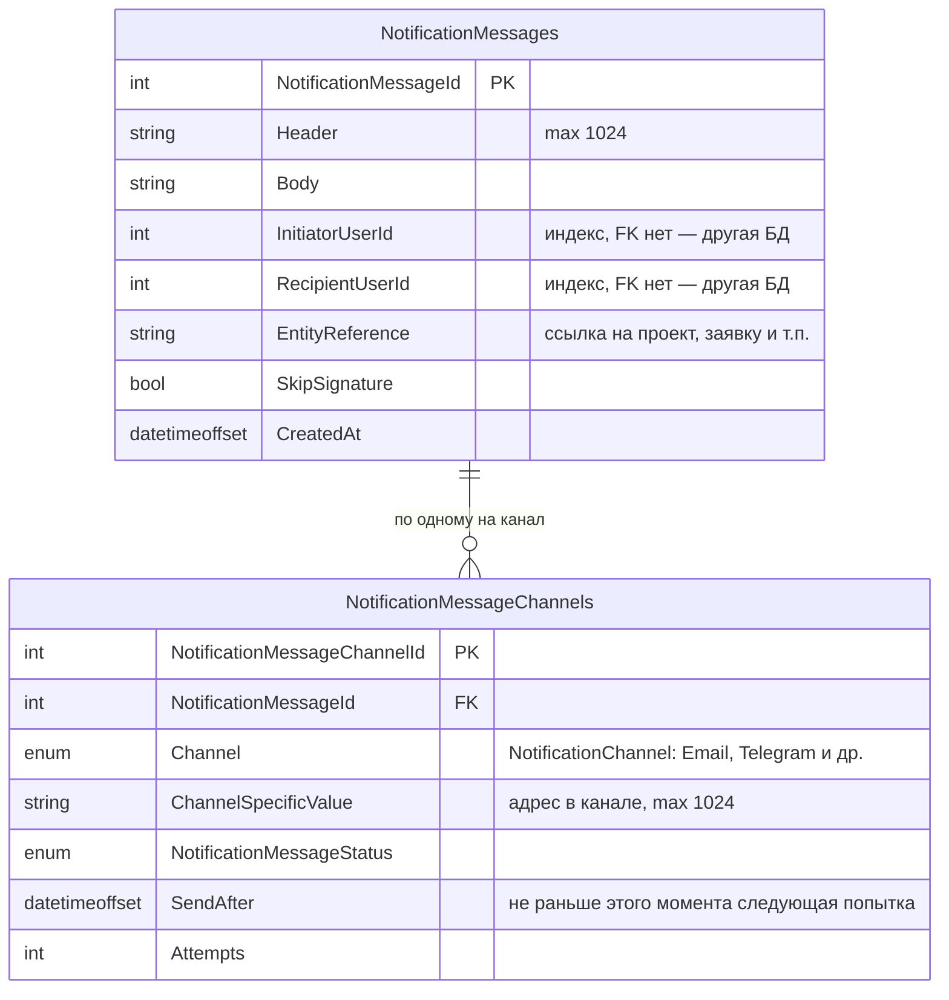

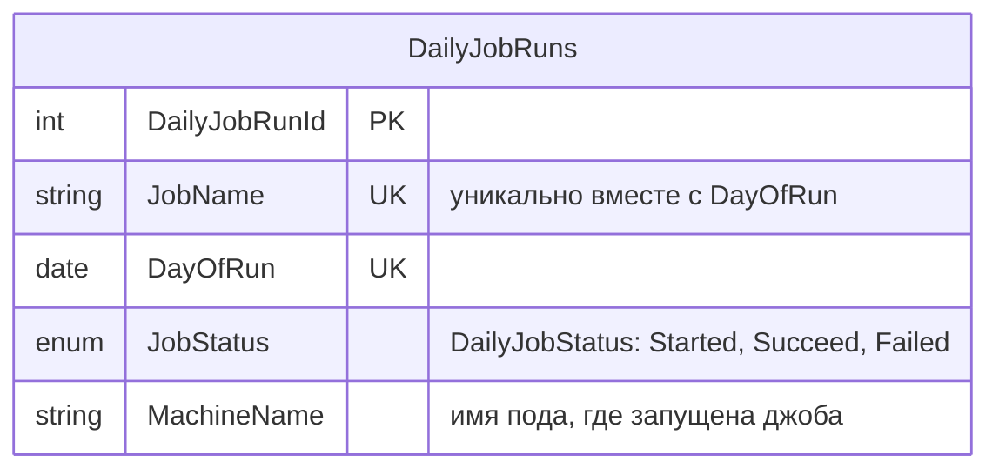

Очередь уведомлений (`JoinRpg.Dal.Notifications`) — [ADR003](adr003-notifications.md);
выборка следующего сообщения идёт сырым SQL с `LIMIT 1 FOR UPDATE SKIP LOCKED`.
Трекинг джоб (`JoinRpg.Dal.JobService`) — [ADR002](adr002-dailyjobs.md); уникальный индекс
`(JobName, DayOfRun)` и есть механизм «не чаще раза в сутки».

---

## Если диаграммы всё равно перегружены

Что можно убрать, по убыванию выигрыша:

1. **Аудиторские поля** — `CreatedAt` / `CreatedById` / `UpdatedAt` / `UpdatedById`
   есть у `Characters`, `CharacterGroups`, `GameReport2DTemplate`, и вместе с ними
   приходят 6 линий на `Users`. Их можно свернуть в одну фразу «у этих таблиц есть
   стандартный аудит» и не рисовать.
2. **Связи с `Projects`** — почти каждая таблица имеет `ProjectId`. Если договориться,
   что «всё, у чего есть `ProjectId`, принадлежит проекту», из доменных диаграмм уходит
   по 3–7 линий каждая.
3. **Связи с `Users`** — то же самое: ответственный мастер, автор, создатель.
   Оставить только смысловые (`Claims.PlayerUserId`, `Comments.AuthorUserId`).
4. **Флаги** — `ProjectAcls` это 11 булевых прав, `ProjectDetails` — два десятка
   переключателей. Их можно свернуть в одну строку `bool Can* "11 флагов прав"`.
5. **Таблицы связей m2m** — `PlotElementCharacters`, `KogdaIgraGameProjects` и прочие
   можно нарисовать как прямое `}o--o{` без промежуточной сущности.
6. **Служебные домены** — `AdvertisementLogEntries`, `GameReport2DTemplate`,
   `AllrpgUserDetails`, `ProjectItemTags` можно вообще не показывать: они почти
   не связаны с остальной схемой.

Минимальная полезная версия — обзорная карта плюс домены 2, 3 и 6
(поля, персонажи-заявки, финансы): в них живёт почти вся неочевидная логика.
